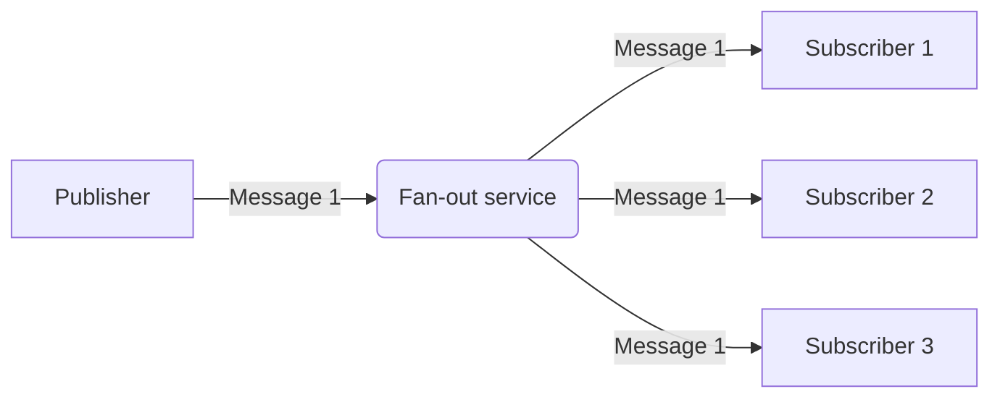

Fan-out is a pattern where a message from a source is spread or copied to one or more destinations. In data engineering, fan-out is commonly used to send data from a microservice (publisher) to multiple subscribers. The fan-out service normally doesn't save the message once it has been sent, so a message queue is also common to see between the fan-out service and the subscriber for catch-up/re-try scenarios.

## Fan-out Advantages

- Send data from one source to many destinations

## Fan-out Disadvantages

- Usually limited re-try capabilities if a subscriber is unavailable for an extended period

