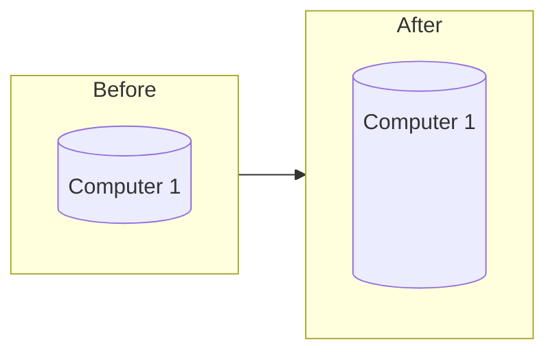

Vertical scaling is when you increase the capacity of a system by increasing the compute size.

## Vertical Scaling Advantages

- Very simple and straight forward
- No code or design changes needed

## Vertical Scaling Disadvantages

- Becomes more expensive (compared to [[Horizontal Scaling|horizontal scaling]]) as more specialized hardware is needed to achieve higher levels of performance
- Increased risk of a single point of failure

