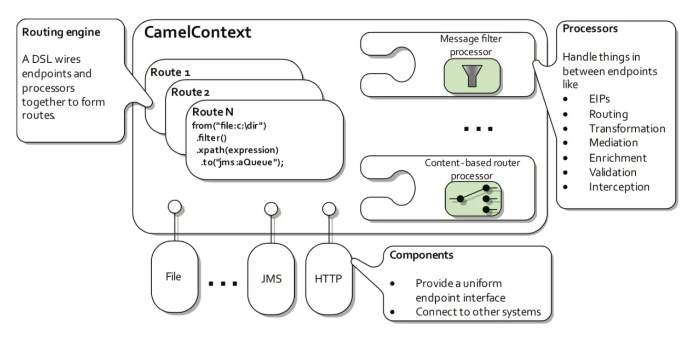

apache camel的核心是维护一个上下文，上下文负责管理传递数据的路由。
提供了一种对于传递数据的上层抽象，使得无论用数据源和目标是哪种类型，都可以使用统一的api来进行处理。

```Java
public class FileCopierWithCamel {

    public static void main(String args[]) throws Exception {
        // create CamelContext
        CamelContext context = new DefaultCamelContext();

        // add our route to the CamelContext
        context.addRoutes(new RouteBuilder() {
            public void configure() {
                /**
                  file: 表示使用文件Component
                  from 表示从哪里获取数据，进行消费
                  to  表示将数据生产到哪里
                 */
                from("file:data/inbox?noop=true").to("file:data/outbox");
            }
        });

        // start the route and let it do its work
        context.start();
        Thread.sleep(10000);

        // stop the CamelContext
        context.stop();
    }
}
```




camel的核心概念：
- camel context  维护多个router
- router    router中定义from ，to ，processor，并发度等。from提供生产者，to提供消费者。
- component 外部数据源或者目标，例如FTPComponent，提供endpoint，服务点给camel router。
- processor 对数据进行 validate，clean ，convertion，enrichment等操作。

从线程模型来说，有
- direct 生产者和消费者共用一个线程。
- thread pool 基于线程池

