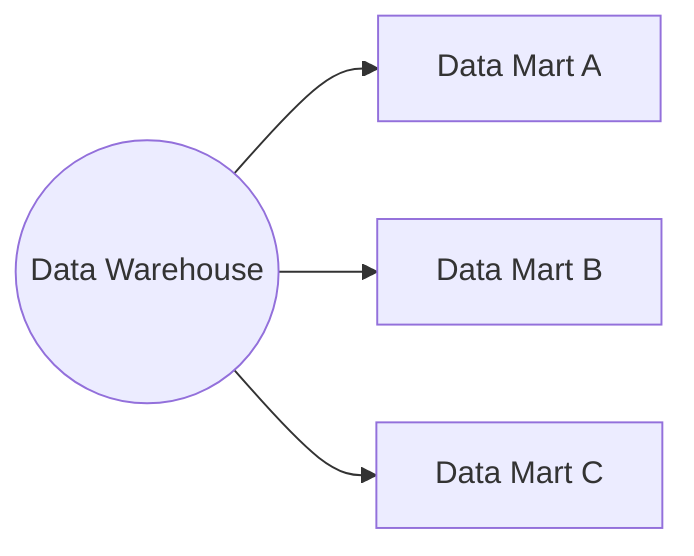

A data mart is a subject-specific database which acts as a partitioned segment of an enterprise data warehouse. The domain of a data mart aligns with a particular business unit - for instance there would be separate data marts created for finance, marketing, or supply chain departments within a company.

## Data Mart Advantages

- In general, better performance due to querying only a subset of data rather than a whole data warehouse. Should also require less resources and maintenance than a monolithic data warehouse.
- The domain focus means data marts should be more flexible and grant bigger user empowerment and encouragement.
## Data Mart Disadvantages

- Data quality risk - the risk of arising discrepancies between a data mart and the original data warehouse.
- Implementation challenges - poor design may lead to extensive complexity and inconsistencies over time.
## Data Mart Learning Resources
[What is a Data Mart? - Data Mart Explained - AWS (amazon.com)](https://aws.amazon.com/what-is/data-mart/)

