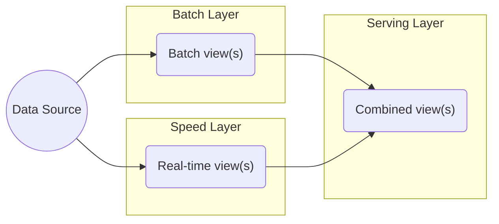

Lambda architecture is a data processing pattern designed to strike a balance between low latency, high throughput, and fault tolerance. This architecture type uses a combination of batch processing to create accurate views of large data sets and real-time stream processing to provide views of live data. The results from both sets can then be merged and presented together.

## Lambda Architecture Advantages

- Efficiently serves batch and real-time workloads

## Lambda Architecture Disadvantages

- Duplicated code/logic for both batch and real-time views

## Lambda Architecture Learning Resources

- http://nathanmarz.com/blog/how-to-beat-the-cap-theorem.html
- http://radar.oreilly.com/2014/07/questioning-the-lambda-architecture.html

