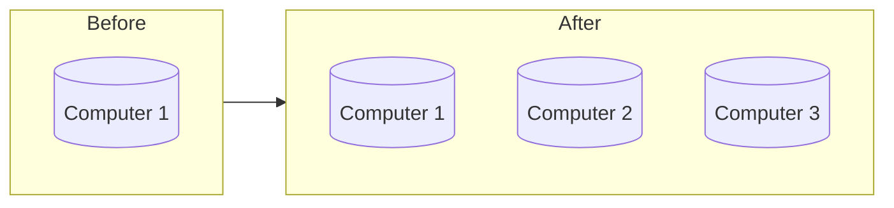

A horizontally scalable system is one that can increase capacity by adding more computers to the system.

## Horizontal Scaling Advantages

- Allows for parallel execution of workloads
- Increased fault tolerance
- Cheaper compared to [[Vertical Scaling|vertical scaling]]

## Horizontal Scaling Disadvantages

- Decreased consistency
- Joining data between nodes is more time consuming

