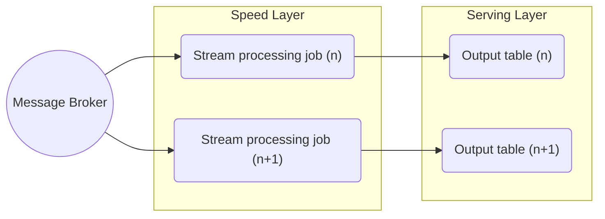

Kappa architecture is a big data processing pattern that has historically diverged from [[Lambda Architecture|Lambda]]. Its foundation is to treat all arriving data as a stream, therefore it contains no batch layer by design, relying solely on a [[Stream Data Processing|stream processing]] layer ("speed layer"). 

## Kappa Architecture Advantages

- Only need to maintain, develop and debug a much smaller codebase compared to Lambda architecture.
- Advantageous for use cases that require high data velocity.
## Kappa Architecture Disadvantages

- General challenges related to implementing stream processing at scale.
- Higher data loss risks by design - requires specific data storage and recovery strategies.
## Kappa Architecture Learning Resources

[Questioning the Lambda Architecture – O’Reilly (oreilly.com)](https://www.oreilly.com/radar/questioning-the-lambda-architecture/)

