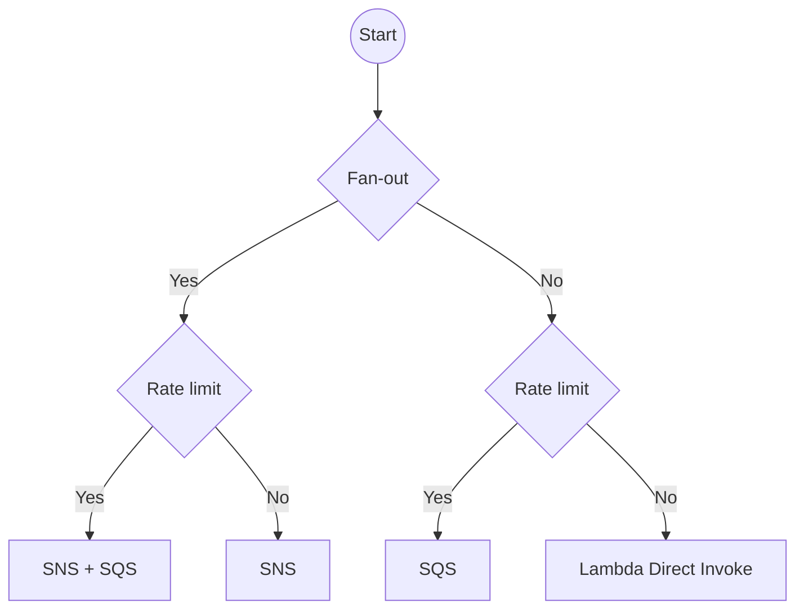

## Overview

A short guide on choosing which messaging service(s) to use.

## AWS

Source: [AWS re:Invent 2020: Scalable serverless event-driven architectures with SNS, SQS & Lambda](https://www.youtube.com/watch?v=8zysQqxgj0I&t=1887s)

## Azure

#placeholder/description 

## GCP

#placeholder/description 

